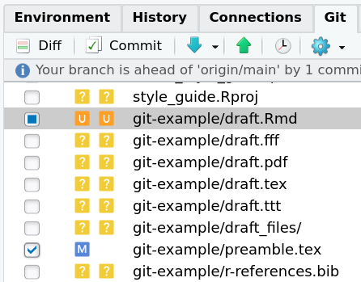
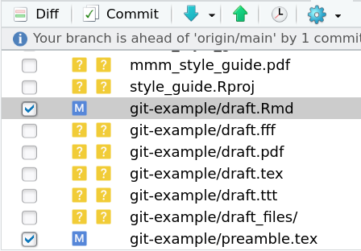

MMM Guide for Using Git and GitHub
================

## Background

Git is a powerful tool but also has a steep learning curve. After lots
of painful experiences dealing with incorrect pushes and merges, we
finally have this dynamic and evolving guide for some basic ground rules
for using Git.

!!! This is not a replacement of investing time to properly learning Git
and GitHub. Please refer to <https://happygitwithr.com/> to get started.
**The chapters all lab members MUST be familiar with are: 7, 9, 11, 14,
17, 20–23, 28**

## Fixing Merge Conflicts Correctly

If you see something like

    >>> /usr/bin/git push origin HEAD:refs/heads/main
    To https://github.com/mmm-usc/style_guide.git
     ! [rejected]        HEAD -> main (fetch first)
    error: failed to push some refs to 'https://github.com/mmm-usc/style_guide.git'
    hint: Updates were rejected because the remote contains work that you do
    hint: not have locally. This is usually caused by another repository pushing
    hint: to the same ref. You may want to first integrate the remote changes
    hint: (e.g., 'git pull ...') before pushing again.
    hint: See the 'Note about fast-forwards' in 'git push --help' for details.

It means that there is a merge conflict. One initial strategy to solve
it is to

1.  Pull changes from `remote`

2.  If one sees the message

        Automatic merge failed; fix conflicts and then commit the result.

    It means that git cannot merge the changes for one or more files.
    Those files are marked in the “U” icon in RStudio

    

3.  Here, git is in the middle of a merge commit, but the commit is not
    finalized. One should go to each file marked with the “U” icon to
    resolve the conflict

4.  After resolving all conflicts of a file, save the file, and then
    check the box to the left of the file so that it becomes

    

    :warning: Do not uncheck other files (e.g., `preamble.tex` in the
    picture) in a merge; leave them as if. Otherwise, the changes made
    in other files in `remote` are lost in the merge commit.

5.  Once conflicts of all files are resolved, click `Commit`. No commit
    message is needed for a merge commit, but one can specify a message
    to describe how conflicts are resolved.

## Avoid Different Versions of a File With Different Names

-   So that changes can be properly tracked

## Commit Often

-   When a small task is done
