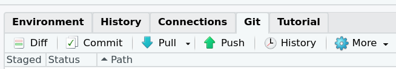

```{r setup, include=FALSE}
knitr::opts_chunk$set(echo = TRUE)
```

## R Code Style

To start, please follow [The tidyverse style guide](https://style.tidyverse.org/). Lab members are welcome to deviate slightly from it moving forward, but it has to be consistent throughout your work. 

- Make sure you document your code as much as possible. It's guaranteed that you won't remember why you write some code after a few days. 
- Put all calls of an external package, i.e., `library()` to the beginning
- Do not include `install.packages()` call in your code
- Generally, do not use dots in naming R objects and functions (e.g., ~~`model.1`~~ &rarr; `model_1` or `model1`)
- Use spaces to make your code easier to read to yourself (e.g., `na.rm = TRUE` rather than `na.rm=TRUE`; see [this section](https://style.tidyverse.org/syntax.html#spacing) in the tidyverse style guide)
- Label the R code chunks

### Naming

R is notorius for not having a convention on how to name variables. Our lab will follow the [convention in the Julia language](https://docs.julialang.org/en/v1/manual/style-guide/#Use-naming-conventions-consistent-with-Julia-base/). Specifically, 

- Use lowercase letters for naming functions and names (e.g., don't do `TypeI`, but use `typei`). If it's possible to combine words without making it hard to comprehend, then combine them (e.g., `runmodel`, `simdata`, `result1`). Otherwise, use underscoe (not dot) to separate words in names (e.g., `extract_aic`). 

### Random number generator

Use `set.seed()` in the beginning to ensure the same numbers are obtained every time you run the results. 

### Tools that you can use

- [`styler`](https://style.tidyverse.org/): A package/add-in for automatically restyling your code according to the `tidyverse` style; 
- [`lintr`](https://github.com/jimhester/lintr): Automated checks to confirm whether your script conforms to the style guide. 

### Long lines

Try to limit to 80 characters per line. For function call that is too long, start a new line for each argument. 

```{r long-line, eval = FALSE}
# Example from https://style.tidyverse.org/syntax.html#long-lines
# Good
do_something_very_complicated(
  something = "that",
  requires = many,
  arguments = "some of which may be long"
)

# Bad
do_something_very_complicated("that", requires, many, arguments,
                              "some of which may be long"
                              )
```


### Functions

- When possible, make sure variables inside a function are passed to the function as an argument, not relying on global variables. So instead of 

```{r foo, eval = FALSE}
b <- 10
foo <- function(a) {
  a + b
}
```

use:

```{r foo-2, eval = FALSE}
foo <- function(a, b = 10) {
  a + b
}
```

### Commenting

For comment of codes, use one `#` followed by a space.

To add comment on another person's work in Markdown/R Markdown, use

```
[Mark Lai]: # (This is a comment.)
```

Reference: https://stackoverflow.com/questions/4823468/comments-in-markdown

## Track Changes/Version Control

In general, avoid creating multiple versions of the same .R or .Rmd file, unless you need both versions at the same time. Instead, use Git to track the changes.

For R code/R Markdown files, a handy tool is the `Diff` button in RStudio.



Or `git diff` in the terminal. See https://git-scm.com/docs/git-diff for more information

For writing, you can try the [`latexdiffr` package](https://cran.r-project.org/web/packages/latexdiffr/) for PDF outputs. Here is an example call

```{r latexdiffr-example, eval = FALSE}
latexdiffr::git_latexdiff(
  "mmm_style_guide.Rmd", 
  revision = "HEAD^",
  # Avoid commenting within code chunsk
  ld_opts = '--add-to-config "VERBATIMENV=Highlighting"')
```

### Git

Use Git for all lab-related projects to track changes in code files. See https://happygitwithr.com/. 

Generally, do not track:

- data files or pictures that are not expected to change
- HTML or PDF outputs that are generated from a .Rmd file (unless they are to be publicly shared)

#### GitHub

There are a few options for sharing Git projects, and you can use any of them. I've been mostly using GitHub. The recommended workflow for setting up a project can be found here: https://happygitwithr.com/new-github-first.html

### Code Review

- https://www.r-bloggers.com/2020/07/best-practices-for-code-review-r-edition/
- https://www.r-bloggers.com/2021/03/code-review-checklist-r-code-edition-top-3/
- https://appsilon.com/write-clean-r-code/

## Writing manuscripts

For journal/conference submissions, check the journal/conference website for any LaTeX template. For APA style manuscripts, use the [`papaja`](https://crsh.github.io/papaja_man/) package. Use [R Markdown](https://rmarkdown.rstudio.com/) in general. 

See the source code of some examples of published articles using `papaja` [here](https://crsh.github.io/papaja_man/published-manuscripts.html)

See https://github.com/mmm-usc/apa7-templates for a template.

### Reproducibility

Use inline R code to extract numbers from results. For example, assuming you've computed the mean of a variable:

```{r mean-y}
set.seed(1)
y <- rnorm(10)
c(mean(y), sd(y))
```

In the manuscript, do not write

````markdown
The mean of the variable is 0.13  (SD = 0.78).
````

but write 

````markdown
The mean of the variable is `r '\x60r printnum(mean(y))\x60'` (SD = `r '\x60r printnum(sd(y))\x60'`).
````

#### Tables and Figures

Whenever possible, include the codes for generating a table or a figure. 

Functions that can help:

- `knitr::kable()`
- functions in the `kableExtra` package (for conditional formatting)
- `papaja::apa_table()`

#### Cross-Referencing

See https://bookdown.org/yihui/rmarkdown-cookbook/cross-ref.html

### Citation tools

- Zotero (lab library: https://www.zotero.org/groups/2460343/mmm-lab-usc)

### Spelling and Grammar Check

- RStudio has internal spell check (Press `F7`)
- [`gramr`](https://github.com/ropenscilabs/gramr)

## Work Flow

- Organize each project as a RStudio project (File --> New Project)
- Don't do `setwd()`. Use the `here` package to locate a file for import ([why?](https://github.com/jennybc/here_here))

<!-- ## Posters, CVs -->

<!-- Check out the interesting [`pagedown`](https://github.com/rstudio/pagedown) package -->

